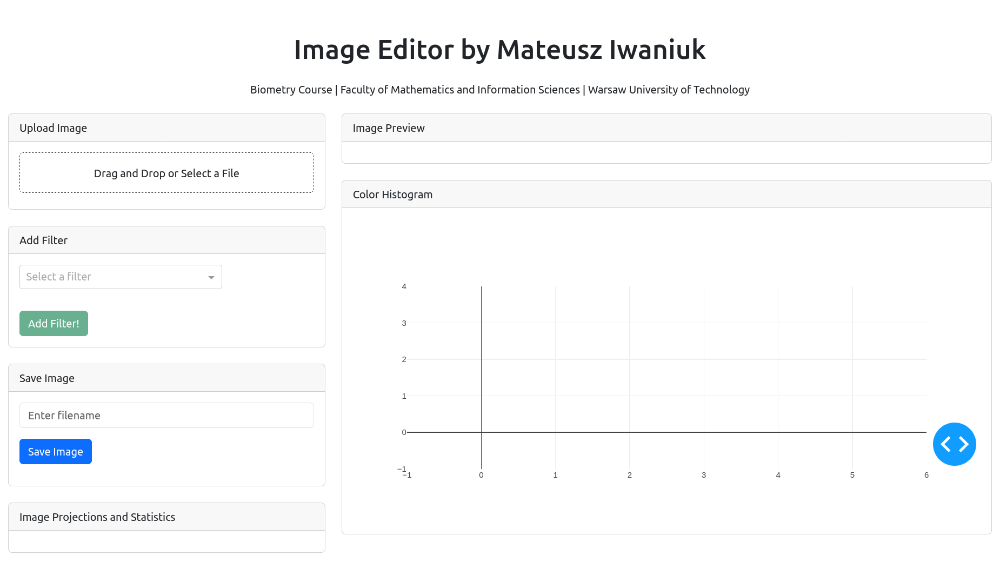
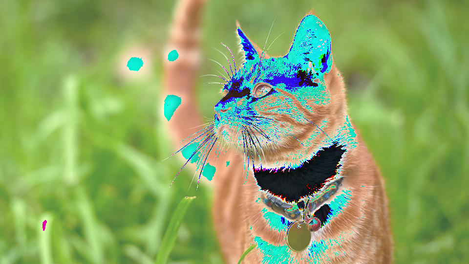
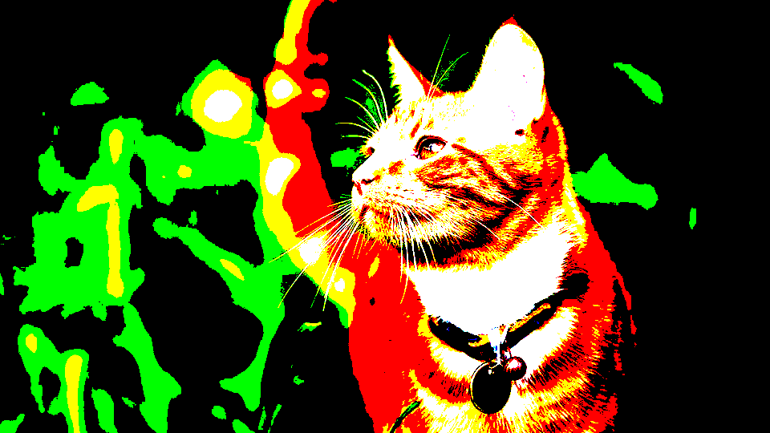
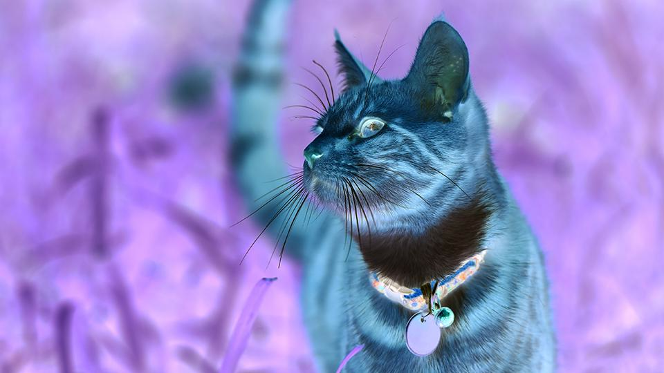
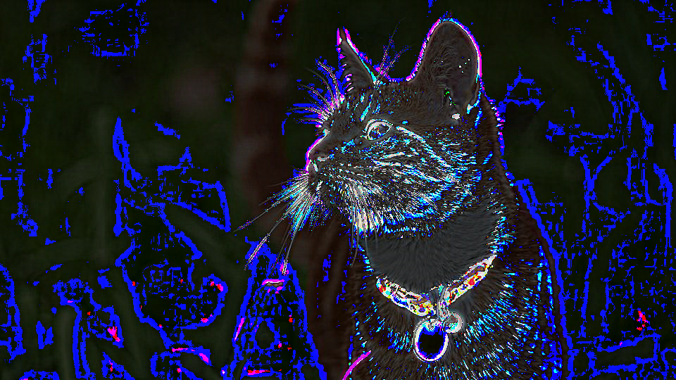
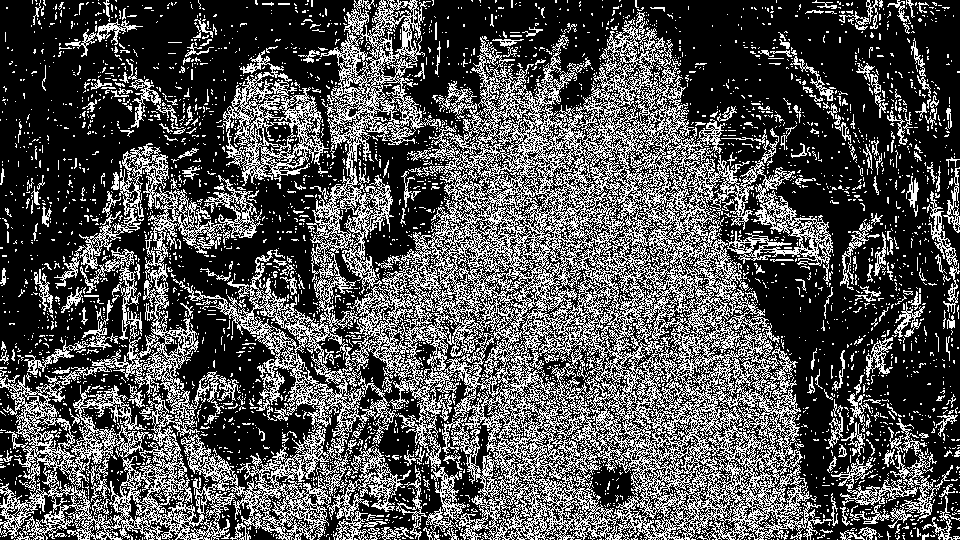
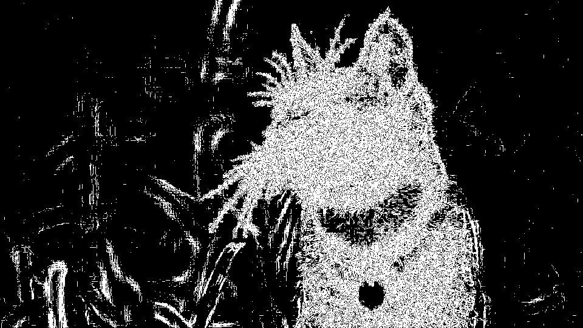
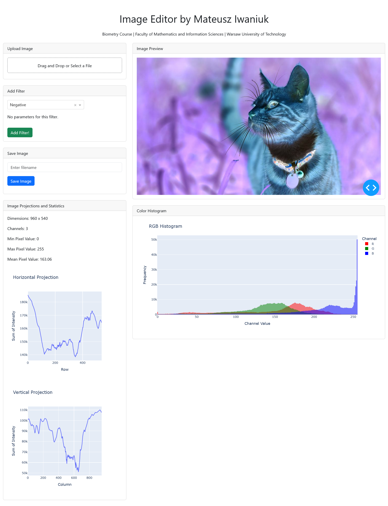

# Image Editor - Project Documentation

## Table of Contents
1. [Introduction](#introduction)
2. [Architecture and Implementation](#architecture-and-implementation)
3. [Image Processing Operations](#image-processing-operations)
4. [User Interface Elements](#user-interface-elements)
5. [Conclusions](#conclusions)
6. [Summary](#summary)

## Introduction

The image editor is an interactive application developed for image processing and analysis. Key features include:
- Loading images from local storage
- Applying basic filters (brightness, contrast, binarization)
- Performing convolution operations (blurring, sharpening)
- Edge detection using Roberts and Sobel operators
- RGB histogram visualization
- Image statistics display
- Exporting processed images

## Architecture and Implementation

### Technology Stack
| Technology | Purpose |
|------------|---------|
| Python 3.9+ | Core programming |
| Dash | Web interface |
| NumPy | Image processing |
| SciPy | Advanced math |
| Plotly | Visualizations |
| Bootstrap | Responsive UI |

### Object-Oriented Design
The application follows OOP principles with:
- **Base interfaces** defining contracts for processors
- **Modular operations** as self-contained classes
- **Pipeline architecture** for sequential processing
- **Parameter validation** for all operations

This design enables:
- Easy addition of new processing operations
- Consistent parameter handling
- Code reusability
- Simplified maintenance

## Image Processing Operations

### Basic Operations
#### Brightness Adjustment

*Parameters: value (-100 to 100)*

#### Contrast Adjustment

*Parameters: value (0.1 to 3.0)*

#### Grayscale Conversion

*Parameters: method, intensity*

#### Binarization

*Parameters: threshold (0-255)*

#### Negative

*No parameters*

### Convolution Operations
#### Average Blur

*Parameters: kernel_size (odd ≥3)*

#### Gaussian Blur

*Parameters: kernel_size, sigma*

#### Sharpening

*Parameters: kernel_size, alpha*

### Edge Detection
#### Sobel Operator

*Parameters: threshold*

#### Roberts Operator

*Parameters: threshold*

## User Interface Elements

Main components:
1. **Image Loading Panel**
   - File upload (JPG/PNG/BMP)
   - Image preview
   
2. **Filter Controls**
   - Operation selection dropdown
   - Dynamic parameter forms
   - Real-time preview

3. **Analysis Panel**
   - RGB histogram
   - Image projections
   - Statistics display

4. **Export Panel**
   - Processed image download
   - Data export (CSV)

## Conclusions

### Implementation Challenges
- State management in Dash
- Real-time preview performance
- Parameter validation across operations

### Possible Extensions
1. Morphological operations
2. Geometric transformations
3. Image segmentation
4. Adaptive filtering
5. Machine learning integration
6. Advanced noise reduction

## Summary

The image editor provides:
- Diverse image processing operations
- Intuitive responsive interface
- Modular extensible architecture
- Real-time processing feedback
- Foundation for future enhancements
